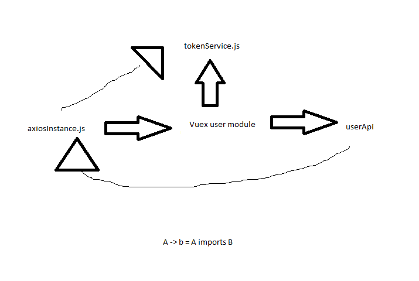

Yo guys I've run into a design problem regarding cyclic dependencies that I can't seem to figure out and I'd like some input. 

[Click here if you dont need the overview](#problem)

## Overview

Right now I have a working login system supports the following:
  1. Login with username and password
      - in LoginForm.vue
      - button calls vuex user module action 'login'
  2. Signup with username, email and password
      - in SignupForm.vue
      - button calls vuex user module action 'signup'
  3. Logout 
      - in TheNavigation.vue 
      - button calls vuex user module action 'logout'
  4. User persistence 
      - User is logged in, closes the tab/window and then reopens it. Still logged in if refresh token hasn't expired
      - in App.vue. 
      - beforeCreate lifecycle hook that calls vuex user module action 'persistUser'
  5. Router guard that restricts the user from visiting certain pages unless they are authenticated.
      - in router.js
      - as of right now the only restricted page is /notes
      - doesn't have admin capabilites yet.

The component logic is all relatively simple and isn't an issue. I am just explaining the project's layout.

### Auth
I have included a new auth folder that contains several modules
  1. constants.js 
      - contains endpoint URLs
      - also contains all the possible states that the user vuex module can be in. 
        - each request has 3 states: request, success, failure.
  2. jwtUtils.js
      - used to get jwt header and body 
      - also used to determine if a jwt is valid (if it has not yet expired)
  3. tokenService.js
      - getters, setters, and "removers" of access and refresh tokens.
      - uses localStorage

auth also contains a folder /api, and here's where it get's complicated

__userApi.js__ 

Used as a wrapper around userApi requests. makes it so our store isn't dealing with any routes. and so it's oblivious to the http library thta we are using.

__axiosInstance.js__

This axios instance must be the instance used for ALL protected api calls. This is because it includes the 'X-Access-Token' header used for backend verification. It has to be in it's own file because even if I bind it to the vue instance, I would not have access to it in the Vue store modules. Vuex store modules are plain javascript files that don't bind the vue instance to 'this'. There is no way that I know of to call the axiosInstance in multiple store modules without importing it.

The most important part of this instance is that it includes axios __response__ interceptors that allow for the incorporation of silent access_token refresh. However, I am not sure if my design has the possibility of an infinite loop as I haven't been able to test it.

The interceptor will only activate upon failed requests with a 401 (Unauthorized) status code. 

It will attempt to retrieve a new access_token from the backend. 

  - If this succeeds, it will then replace the access_token in localStorage, update the header of the failed request and attempt to redo the request. All future requests will also be made with the new access_token

  - if it fails with a non 2XX status (modifiable) axios will throw an error which will be caught, and the user will be logged out (all tokens deleted) in the catch block.
    - __NOTE__: I am not sure if the interceptor is allowed to be called recursively, because there is a possibility that this 4XX error could be a 401, which could be intercepted be the interceptor. There is a possibility for an infinite loop here.

### Vuex user module

state consists of:
  * status: a string representing the status of the latest request
  * user: an object that should contain properties of the user once logged in. (not incorporated yet)
  * isAuthenticated: a boolean representing if the user is currently authenticated

actions:
- login
- signup 
- logout 
- persistUser 

## Problem

What I have now is a dependency cycle due to the interceptor. The interceptor commits very simple mutations to change store.user.status (one of TOKEN_REFRESH_REQUEST, TOKEN_REFRESH_SUCCESS, TOKEN_REFRESH_FAILURE).

It also dispatches a logout catch in the branch 

